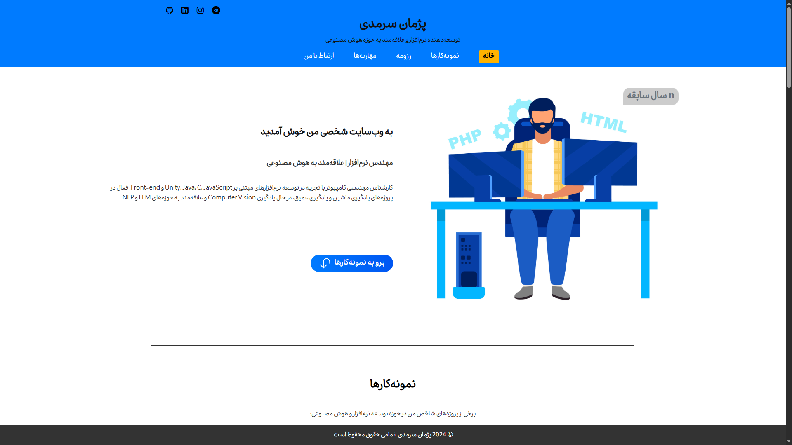

<!-- Banner -->
<p align="center">
  
</p>

<h2 align="center">پروژه وب‌سایت شخصی</h2>


این وب‌سایت شخصی با هدف ارائه رزومه، مهارت‌ها، نمونه‌کارها و راه‌های ارتباطی به صورت حرفه‌ای و مدرن طراحی شده است. ساختار پروژه به گونه‌ای است که به راحتی قابل توسعه و شخصی‌سازی برای هر برنامه‌نویس یا متخصص حوزه فناوری می‌باشد.


- طراحی کاملاً واکنش‌گرا و مدرن
- ساختار سمانتیک و بهینه برای SEO
- معرفی حرفه‌ای نمونه‌کارها و سوابق
- فرم تماس با قابلیت ارسال ایمیل
- استفاده از فونت و آیکون سفارشی
- کدنویسی تمیز و قابل توسعه

---

##  ابزارها

<p align="center">
  
  
  
  
  
</p>

---

## 📁 ساختار پروژه

```text
personal-website/
├── css/
│   ├── main.css           # استایل‌های پایه
│   └── responsive.css     # استایل‌های واکنش‌گرا
├── fonts/                 # فونت‌های سفارشی
├── images/                # تصاویر و نمونه‌کارها
├── js/
│   └── main.js            # اسکریپت اصلی
├── index.html             # صفحه اصلی سایت
└── README.md              # توضیحات پروژه
```

---

##  پیش‌نمایش

<p align="center">
  
</p>

<p align="center">
  <a href="https://pezhm4n.github.io/personal-website">
    
  </a>
</p>
---

##  راهنمای اجرا

1. پروژه را کلون یا دانلود کنید:
   ```bash
   git clone https://github.com/Pezhm4n/personal-website.git
   ```
2. فایل `index.html` را در مرورگر باز کنید.

---


<p align="center">
  <a href="mailto:pksarmadi@gmail.com"></a>
  <a href="https://github.com/Pezhm4n"></a>
  <a href="https://t.me/Sarmadi_P"></a>
  <a href="https://www.linkedin.com/in/pezhman-sarmadi"></a>
</p>


